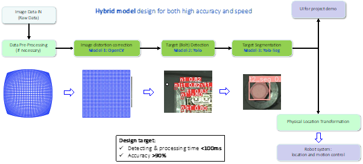
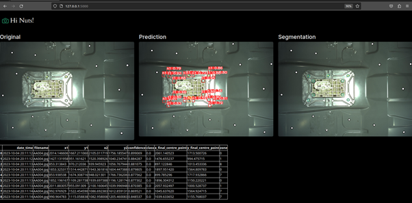

# Introduction
The **Object Detection System** is an application designed and developed by a group of 4 - Zhou Zhibiao, Sureshkumar Sujatha, Tan Jun Ming and Lim Zhi Jing - during our Master of Technology in Artificial Intelligence Systems Programme in NUS-ISS. 

The objective of this development is to develop an object detection application to assist in building a robotic disassembly system. Specifically, our developed system is designed to process the image taken by the camera mounted on an industry six-axis robot arm and identify all the bolts to be removed. Thereafter, our system will provide the bolts’ physical coordinates to the robot for automated unbolting.

As a proof-of-concept, a UI has been designed for user to upload an image to be processed. Bolts in the images will be identified along with the coordinates tabulated. 

| |
|:-----------------------------------:|
| Fig. Architecture Overview |

The overall architecture for the application is as depicted in the figure above. The key components and techniques used in the developments include:
1. Image Distortion Correction
2. Object Recognition (fine-tuned Yolo v8 base)
3. Object Edge Detection (fine-tuned Yolo segmentation)

# Setting up of the application


## 1. Setting up virtual environment

- Set up a new virtual environment with the python version `python = 3.11.9`
- Install the required libraries from requirements.txt
    
    `pip install -r requirements.txt`
    

## 2. Download of source code from github

- Download the code from this github repo.
        

## 3. Start the application

- Navigate to the repo folder in which the [app.py](http://app.py) is located. Run the following commands.
    - For *Windows*
        
        ```bash
        set FLASK_APP=app
        set FLASK_DEBUG=1
        flask run
        ```
        
    - For *Linux*
        
        ```bash
        export FLASK_APP=app
        export FLASK_DEBUG=1
        flask run
        ```
        
- The application will be running on localhost `http://127.0.0.1:5000/`

## 4. Testing of UI

- Some testing images are saved in the folder .\test_images. Feel free to test them out or try with your own images. 

| |
|:-----------------------------------:|
| Fig. UI snapshot |

- The output of the processed image will be shown in the UI as shown in the image above.